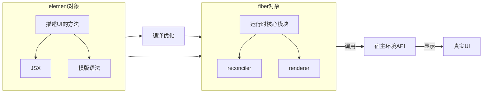
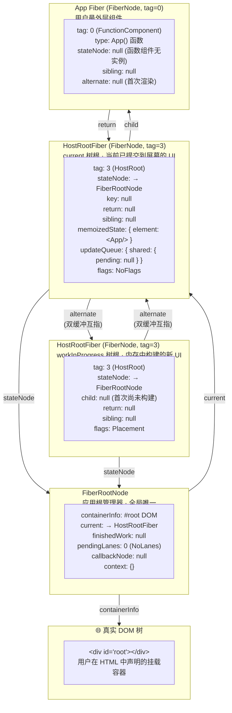
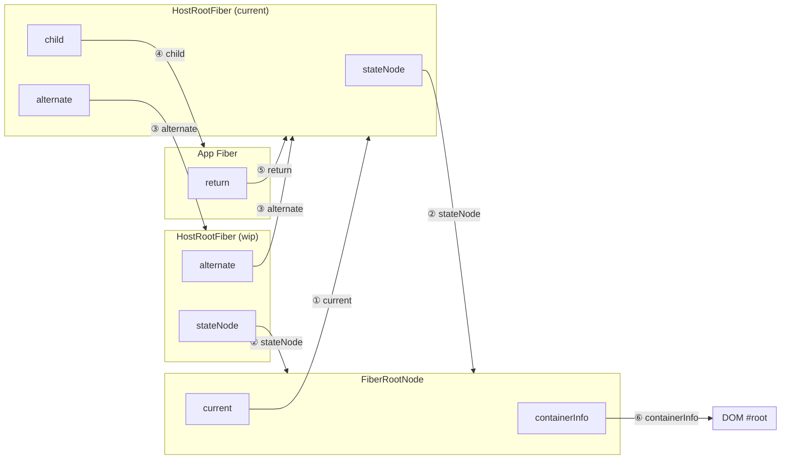
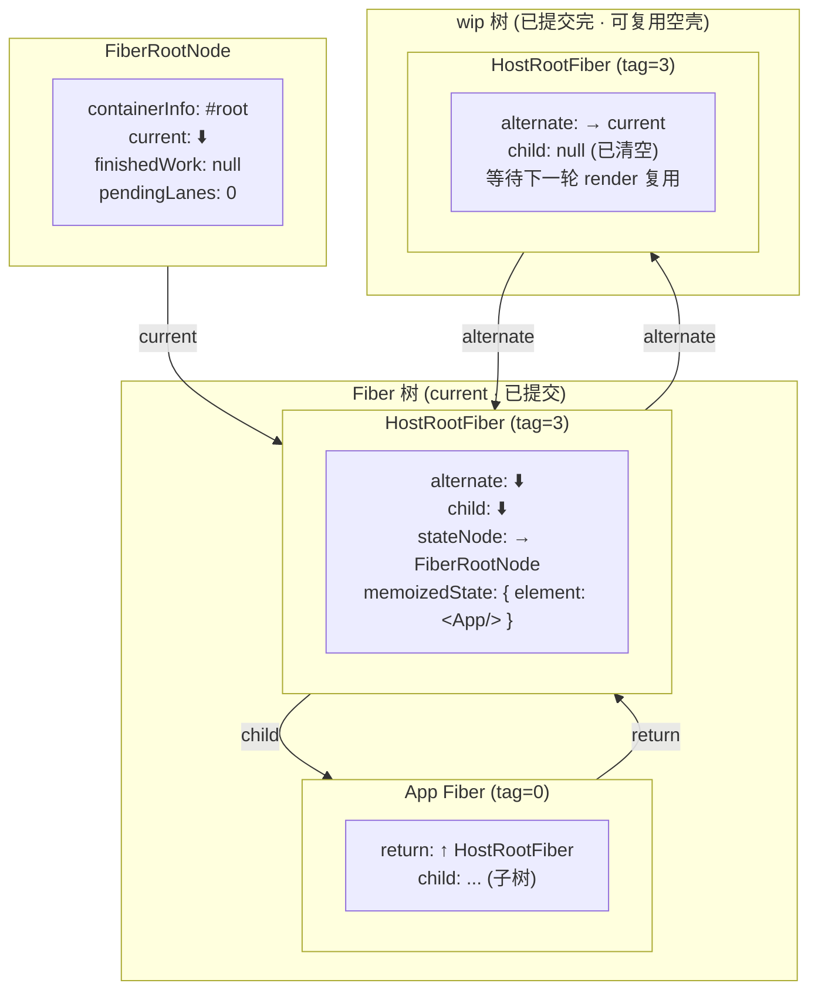

# react

## React中数据结构



## FiberNode 数据结构 (React 18.2)

`FiberNode` 是 React 运行时最小的工作单元，既保存组件信息，也构成可遍历的 Fiber 树（单链表树结构）。

源码位置：`packages/react-reconciler/src/ReactFiber.new.js`

```ts
function FiberNode(
  tag: WorkTag,        // 组件类型标记（FunctionComponent / ClassComponent / HostRoot 等）
  pendingProps: mixed, // 即将被应用的新 props
  key: null | string,  // 唯一标识，用于 diff 中复用节点
  mode: TypeOfMode,    // 模式标记（ConcurrentMode / StrictMode 等）
) {
  // ================================================================
  // 1. 实例信息 —— 描述这个 Fiber 对应哪个组件 / DOM 节点
  // ================================================================

  // 组件类型（WorkTag 枚举值）
  //   0  = FunctionComponent
  //   1  = ClassComponent
  //   2  = IndeterminateComponent（尚未确定是函数还是类组件）
  //   3  = HostRoot（根节点，即 ReactDOM.createRoot 创建的容器）
  //   5  = HostComponent（浏览器环境下的 DOM 元素，如 div、span）
  //   6  = HostText（文本节点）
  //   7  = Fragment
  //   9  = ContextConsumer
  //   10 = ContextProvider
  //   11 = ForwardRef
  //   12 = Profiler
  //   13 = SuspenseComponent
  //   14 = MemoComponent
  //   15 = SimpleMemoComponent
  //   16 = LazyComponent
  //   22 = SuspenseListComponent
  //   24 = OffscreenComponent
  this.tag = tag;

  // 唯一标识，和 element.key 对应，用于 reconciliation 时判断节点是否可复用
  this.key = key;

  // JSX 中调用的组件，即 <App /> 中的 App（函数 / 类引用）
  //   - HostComponent 时：字符串，如 'div'
  //   - 自定义组件时：组件的函数或类本身
  // 注意与 type 的区别：
  //   elementType 是 JSX 中原始传入的类型（可能是 Lazy、Memo 包装的）
  //   type 是解析后最终的类型（剥掉 Lazy / Memo 等外壳）
  this.elementType = null;

  // 解析后的最终类型，与 elementType 可能不同
  //   - FunctionComponent：函数本身
  //   - ClassComponent：类本身
  //   - HostComponent：字符串 'div' / 'span' 等
  this.type = null;

  // 对应的真实节点引用
  //   - HostRoot：FiberRootNode 实例
  //   - HostComponent / HostText：真实 DOM 节点
  //   - 函数 / 类组件：组件实例（类组件为 this，函数组件始终为 null）
  this.stateNode = null;

  // ================================================================
  // 2. Fiber 树结构 —— 构成可遍历的单链表树（child → sibling → return）
  //    React 从不递归遍历，而是用 while 循环 + 这三个指针完成 O(n) 深度优先遍历
  // ================================================================
  // 示意图：
  //         Parent (Fiber)
  //        /     |     \
  //   [child]  [sibling] [sibling]  -- 通过 sibling 链接兄弟节点
  //     /  \
  //  ...  ...
  //  每个子节点通过 return 指回父节点

  // 父 Fiber，构成单向链回树根的路径
  this.return = null;

  // 第一个子 Fiber
  this.child = null;

  // 下一个兄弟 Fiber
  this.sibling = null;

  // 在父节点的子列表中的位置索引，用于 reconciliation 中的 key 匹配
  this.index = 0;

  // ref 对象 / 回调函数
  //   - 对象形式：{ current: ... }（useRef / createRef）
  //   - 回调形式：(instance) => void
  this.ref = null;

  // React 18.2 新增：ref 的清理函数
  //   当 ref 回调被替换或组件卸载时，用旧 ref 值调用此函数来清理副作用
  this.refCleanup = null;

  // ================================================================
  // 3. 状态 & Props —— 驱动组件更新的核心数据
  // ================================================================

  // 新的、即将生效的 props（从 JSX 或最新一次 setState 计算得来）
  this.pendingProps = pendingProps;

  // 已生效的 props，上次渲染确认后的 props 快照
  this.memoizedProps = null;

  // 更新队列（UpdateQueue），存储所有待处理的更新（setState / forceUpdate / hook 更新）
  //   不同组件类型的 updateQueue 结构不同：
  //     - ClassComponent：{ baseState, firstBaseUpdate, lastBaseUpdate, shared: { pending } }
  //     - HostRoot：同上，state 为整个应用根 state
  this.updateQueue = null;

  // 已生效的状态
  //   - ClassComponent / HostRoot：最新的 state 值
  //   - FunctionComponent：Hooks 链表头节点（Hooks 以单向链表形式挂载在 memoizedState 上）
  this.memoizedState = null;

  // Context 依赖集合
  //   - 记录该 Fiber 订阅了哪些 Context（用于判断 Context 变化时是否需要更新）
  //   - 结构：{ lanes: Lanes, firstContext: ContextDependency, responders: ... }
  this.dependencies = null;

  // 渲染模式
  //   - NoMode(0)：同步渲染（ReactDOM.render 默认）
  //   - ConcurrentMode(1)：并发渲染（ReactDOM.createRoot）
  //   - StrictMode(2)：严格模式
  //   同时支持位掩码组合多个模式
  this.mode = mode;

  // ================================================================
  // 4. 副作用标记 —— 标记 Fiber 需要执行的 DOM 操作
  // ================================================================

  // 自身副作用标记（位掩码，单个位代表一种操作）
  //   关键位：
  //     Placement(0b000000000000000000000010)    → 插入 DOM
  //     Update(0b000000000000000000001000)       → 更新 DOM 属性
  //     Deletion(0b0000000000000000000001000)    → 删除 DOM
  //     ChildDeletion(0b000000000000000000010000)→ 删除子节点
  //     ContentReset(0b000000000000000000000001) → 清空文本内容
  //     Ref(0b0000000000000000100000000)         → 附加 / 解绑 ref
  //     Snapshot(0b0000000001000000000000000)    → 类组件 getSnapshotBeforeUpdate
  //     Passive(0b00000100000000000000000000)    → useEffect 回调
  //     LayoutMask：commit 阶段 layout 子阶段执行的 flags 集合
  //   React 18 使用二进制位运算 → 一个 Fiber 可同时标记多种副作用
  //   注意：从 effectTag 重命名为 flags（React 18 重构）
  this.flags = NoFlags;

  // 子树副作用标记：表示子节点中是否存在某种副作用
  //   React 18 用于优化 —— 无需遍历整个子树就能判断是否需要处理某个副作用
  //   例如：子树中是否有 Placement、是否有 useEffect（Passive）
  //   在 completeWork 阶段，子节点的 flags 会冒泡到父节点的 subtreeFlags 上
  this.subtreeFlags = NoFlags;

  // 待删除的子 Fiber 数组
  //   React 18 不再使用 effect list（firstEffect / lastEffect），
  //   而是在 commit 阶段直接遍历 Fiber 树，子节点的删除记录在此数组中
  //   在 commit 阶段的 mutation 子阶段统一处理
  this.deletions = null;

  // ================================================================
  // 5. 调度优先级 —— Lane 模型
  // ================================================================

  // 当前 Fiber 上待处理的更新的优先级（位掩码）
  //   - 每个二进制位代表一条"车道"，对应一个调度优先级
  //   - 例：SyncLane(0b1) = 同步立即执行，DefaultLane(0b10000) = 默认并发优先级
  //   - setState 会设置当前及祖先的 childLanes
  this.lanes = NoLanes;

  // 子树中存在的更新的优先级（合并了所有子节点的 lanes）
  //   - 用于复用检查：如果 childLanes 为空，说明整棵子树无需更新，可直接复用
  //   - bailout 优化的核心判断依据
  this.childLanes = NoLanes;

  // ================================================================
  // 6. 双缓冲 —— current 树 ↔ workInProgress 树
  // ================================================================

  // 指向另一棵 Fiber 树中对应的 Fiber 节点
  //   - current.alternate = workInProgress
  //   - workInProgress.alternate = current
  //
  //   React 维护两棵 Fiber 树：
  //     current 树：屏幕当前显示对应的状态（已提交）
  //     workInProgress 树：正在内存中构建的新状态
  //
  //   提交完成后，两棵树角色互换（通过 root.current 指针切换）
  //   这种双缓冲机制避免了渲染过程中屏幕可见 DOM 被部分修改
  this.alternate = null;
}
```

### Fiber 树遍历模型

```text
                    HostRoot (tag=3)
                    │
                    │ child
                    ▼
                  App (FunctionComponent, tag=0)
                    │
                    │ child
                    ▼
                   div (HostComponent, tag=5)
                   /        \
             child           sibling
              ▼                ▼
            h1 (tag=5)    p (tag=5)
            /      \
       child    sibling
         ▼        ▼
    文本(tag=6)  span(tag=5)
```

每个节点通过 `child`、`sibling`、`return` 三个指针串联，React 用 `while` 循环而非递归来完成深度优先遍历（`performUnitOfWork`），时间复杂度 O(n)，且不会被长组件栈溢出打断。

### 关键设计要点

| 设计 | 说明 |
| ---- | ---- |
| **双缓冲** | current 树 + workInProgress 树，通过 `alternate` 互指，commit 后交换角色，避免屏幕出现不完整的 UI |
| **Lane 模型** | 31 位车道优先级，取代了旧的 `expirationTime` 模型，支持更细粒度的更新优先级和中断/恢复 |
| **subtreeFlags** | 子节点副作用向上冒泡，避免遍历整棵树来判断是否需要处理副作用，React 18 的核心性能优化 |
| **deletions 数组** | 取代了 React 17 的 effect list（firstEffect/lastEffect/nextEffect），简化了副作用遍历 |
| **Hooks 链表** | 函数组件的 Hooks 以单向链表挂载在 `memoizedState` 上，每个 Hook 通过 `next` 指针串联 |

---

## FiberRootNode → HostRootFiber → App 初始化链路

> `ReactDOM.createRoot(document.getElementById('root')).render(<App />)` 的内存数据结构全景。

源码位置：

- `FiberRootNode` — `packages/react-reconciler/src/ReactFiberRoot.new.js`
- `createContainer` / `createFiberRoot` — `packages/react-reconciler/src/ReactFiberRoot.new.js`

### 结构全景图



### 指针关系速查



### 初始化步骤

```mermaid
flowchart TD
  START["ReactDOM.createRoot(container)"] --> S1

  subgraph CREATE["createFiberRoot()"]
    S1["1. createContainer(container)"] --> S2["2. new FiberRootNode()<br/>root.containerInfo = container"]
    S2 --> S3["3. createHostRootFiber()<br/>创建 uninitializedFiber (tag=3)"]
    S3 --> S4["4. 互相关联<br/>root.current = uninitializedFiber<br/>uninitializedFiber.stateNode = root"]
    S4 --> S5["5. initializeUpdateQueue()<br/>准备接收 &lt;App/&gt;"]
    S5 --> S6["6. return root (FiberRootNode)"]
  end

  S6 --> MEM["内存中: FiberRootNode ↔ HostRootFiber<br/>containerInfo → #root DOM"]

  MEM --> S7["7. root.render(&lt;App/&gt;)<br/>创建 update: payload = { element: &lt;App/&gt; }<br/>enqueueUpdate()"]

  S7 --> S8["8. scheduleUpdateOnFiber()"]

  S8 --> S9

  subgraph RENDER["render 阶段"]
    S9["9. prepareFreshStack(root)<br/>createWorkInProgress() 克隆 wip<br/>建立双缓冲: alternate 互指"]
    S9 --> S10["10. beginWork (向下递)<br/>updateHostRoot → 取出 &lt;App/&gt;<br/>reconcileChildren → 创建 App Fiber<br/>逐层向下构建 Fiber 子树"]
    S10 --> S11["11. completeWork (向上归)<br/>HostComponent → 创建真实 DOM<br/>冒泡 subtreeFlags"]
    S11 --> S12["12. root.finishedWork = workInProgress"]
  end

  S12 --> S13

  subgraph COMMIT["commit 阶段"]
    S13["13. commitRoot(root)<br/>mutation: 执行 DOM 插入<br/>layout: useLayoutEffect / componentDidMount"]
    S13 --> S14["14. root.current = root.finishedWork<br/>指针切换 —— 双缓冲角色互换！"]
  end

  S14 --> DONE["✅ 页面渲染完成<br/>旧的 current 树留作下一轮复用"]
```



### 初始化后内存快照



> **关键结论**: `FiberRootNode` 是整个应用的"仪表盘"，全局唯一。它的 `current` 指针在每次 commit 后切换到新树。HostRootFiber 是 Fiber 树的"树桩"——Fiber 树上所有节点的 `return` 最终都会追溯到它。HostRootFiber 和 FiberRootNode 通过 `stateNode` ↔ `current` 形成双向绑定。App Fiber 是用户代码的入口，挂在 HostRootFiber 的 `child` 上。
